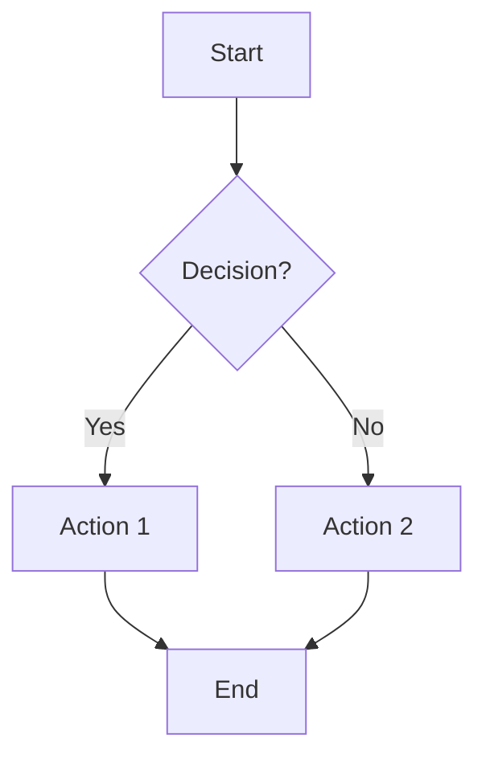
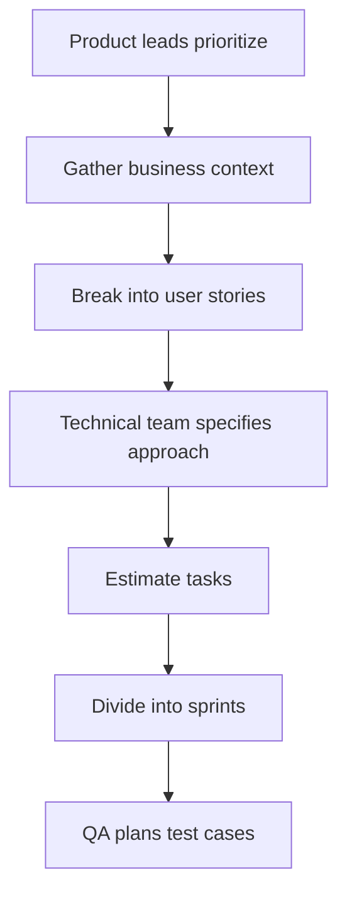

# Process Documentation / Guidelines Template

## Use Case
Documenting workflows, procedures, and guidelines that teams need to follow consistently. Ideal for onboarding documentation, development guidelines, approval workflows, and operational procedures.

**Target Length:** 1500–3000 words
**Tone:** Instructional, authoritative, systematic
**Primary Audience:** Team members, new hires, stakeholders

---

## Template Structure

```markdown
# [Icon] [Process/Guideline Name]

[Callout block with important prerequisite or access note]

## Setup / Overview
- High-level context
- Key concepts or prerequisites
- Links to external resources

## Mandatory to read before [action]:
- [Critical documentation 1]
- [Critical documentation 2]

## Workflow / Process Steps

**General rules**
1. Rule 1 with clear directive
2. Rule 2 with consequences/reasoning
3. Rule 3 with examples

**Step-by-step Process**

[Optional: Mermaid flowchart for visual process flow]

### [Step 1 Name]
Description of what happens at this stage

### [Step 2 Name]
Description with specific requirements

## Status Definitions

| Status | Meaning | Action Required |
|--------|---------|-----------------|
| Status 1 | Definition | Who does what |
| Status 2 | Definition | Who does what |

## Best Practices / Recommendations
- Recommendation 1 with reasoning
- Recommendation 2 with examples

## [Optional: Advanced Topics]
Detailed subsections for complex scenarios
```

---

## Filling Instructions

### 1. Title
- **Format:** `[Icon] [Process/Guideline Name]`
- **Icons:** 🗺️ for planning/process, 🧟 for project guidelines
- **Examples:** "🧟 Flutter project guidelines", "🗺️ Epic Planning"

### 2. Opening Callout
- **Purpose:** Highlight prerequisites or access requirements
- **Format:** 💡 Gray background for tips, 🟡 Yellow for important notes, ⚠️ for warnings
- **Example:** "Requires access to staging environment. Contact DevOps if needed."

### 3. Setup / Overview
- **Length:** Bullet list, 3–5 items
- **Content:** Context, prerequisites, key concepts
- **Links:** External resources, related documentation

### 4. Mandatory Reading
- **Purpose:** Clear what documentation must be read first
- **Format:** Bulleted list of links with brief descriptions
- **Clarity:** Help readers understand dependencies

### 5. General Rules
- **Format:** Numbered list (1, 2, 3...)
- **Content:** Each rule includes directive + reasoning or consequence
- **Example:** "1. Always create feature branches from main. This ensures you don't accidentally push to production."

### 6. Step-by-Step Process
- **Headings:** Use `###` for each step
- **Sequence:** Numbered if sequential, bullets if non-sequential
- **Detail:** Include specific requirements and expected outcomes

### 7. Flowchart (Optional)
- **Tool:** Mermaid syntax for diagrams
- **When to Use:** Complex multi-step workflows with decision points
- **Clarity:** Flow should complement written steps

### 8. Status Definitions
- **Format:** Three-column table: Status | Meaning | Action Required
- **Purpose:** Prevent confusion about states and next steps
- **Color-Coding:** Use background colors (green_bg, yellow_bg, blue_bg) to indicate progress

### 9. Best Practices
- **Format:** Bulleted list with explanation
- **Content:** Lessons learned, recommendations, dos and don'ts
- **Examples:** Include concrete examples for abstract concepts

### 10. Advanced Topics (Optional)
- **Depth:** For complex scenarios requiring additional context
- **Organization:** Sub-sections with `####` headings

---

## Metadata / Properties to Set

**Essential Properties:**
- **Name/Title:** Same as page title
- **Type:** Process Documentation, Guideline, Workflow
- **Owner:** Primary author/maintainer
- **Project:** Associated project or team

**Common Properties:**
- **Status:** Draft, In Progress, Approved, Active
- **Created/Last Edited Time:** Automatic metadata
- **Stakeholders:** People property for multi-owner docs

**Conditional Properties:**
- **Approval status:** Approved, Pending Review, Archived
- **Related documents:** Links to related guidelines
- **Location:** Hierarchical path in documentation structure

---

## Tone Guidelines

### Voice
- **Instructional:** "You should...", "The team will...", "Follow these steps..."
- **Authoritative:** Clear directives without equivocation
- **Systematic:** Step-by-step organization with clear sequence

### Structure
- **Numbered Steps:** For sequential procedures
- **Bulleted Lists:** For non-sequential items
- **Rationale:** Explain "why" when non-obvious

### Examples
- ✅ "1. Review tickets daily to identify duplicates. This reduces triage overhead."
- ✅ "When creating feature branches, use format `feature/<ticket>-<description>`"
- ❌ "Maybe review tickets sometimes?" (too vague)
- ❌ "Try to be careful with branches" (imprecise)

---

## Visual Design Patterns

### Section Organization
- Use `##` for primary sections (Setup, Workflow, Best Practices)
- Use `###` for procedural steps and subsections
- Use `####` rarely (only in very complex docs)

### Color-Coded Status Tables
```markdown
| Status | Meaning | Action |
|--------|---------|--------|
| 🟢 Ready | Approved and ready to execute | Proceed with step |
| 🟡 On Hold | Waiting for clarification | Contact team lead |
| 🔴 Blocked | Critical blocker identified | Link to issue |
```

### Flowcharts
Use Mermaid for visual workflows:



### Callout Blocks
- **💡 Gray:** Tips and context
- **🟡 Yellow:** Important notes, prerequisites
- **⚠️ Orange:** Warnings
- **🔴 Red:** Critical errors or blockers

### Code Blocks
When documenting technical processes:

```bash
# Example command structure
git checkout -b feature/LMD-123-feature-description
```

```javascript
// Example code pattern
const featureBranchRegex = /^feature\/[A-Z]+-\d+-/;
```

---

## Quick Checklist

Before publishing:

- [ ] **Title** includes icon and clear process name
- [ ] **Opening callout** highlights critical prerequisites
- [ ] **Overview** section provides context and key concepts
- [ ] **Mandatory reading** links are clear and necessary
- [ ] **General rules** are numbered with reasoning provided
- [ ] **Step-by-step process** is organized sequentially
  - [ ] Each step has clear description
  - [ ] Prerequisites and expected outcomes stated
- [ ] **Status definitions** table is comprehensive
  - [ ] All possible states are listed
  - [ ] Actions for each state are clear
- [ ] **Best practices** include concrete examples
- [ ] **Links** to related documentation are current
- [ ] **Tone** is instructional without being condescending
- [ ] **No vague language:** All directives are specific
- [ ] **Properties** are set: Owner, Status, Type, Stakeholders

---

## Real-World Example

```markdown
# 🗺️ Epic Planning Process

💡 This document describes how we plan and structure epics. Familiarity with Sprint Planning is assumed. See [Sprint Planning Guide] for background.

## Setup / Overview
- Epics are large bodies of work spanning multiple sprints, typically 1–3 months
- Each epic contains user stories, which contain individual tasks
- Product leads work with dev teams to define technical approach before coding starts
- Business context, technical requirements, and estimated effort guide prioritization

## Mandatory to read before planning an epic:
- [User Story Definition & Acceptance Criteria](link)
- [Task Estimation Guidelines](link)
- [Definition of Done Standards](link)

## Epic Planning Workflow

**General rules**
1. Always start with business context. This ensures technical decisions align with product goals.
2. Involve at least one senior dev in planning. They catch technical risks early.
3. Break epics into stories before assigning to sprints. This prevents scope creep.
4. Estimate all tasks before sprint planning. QA needs time for test case preparation.

**Step-by-step Process**



### 1. Product Lead Prioritization
Product leads receive a list of opportunities and rank by business impact. Work with stakeholders to align on top 3–5 epics for current quarter.

### 2. Gather Business Context
- [ ] Write epic summary (1–2 sentences of business value)
- [ ] Define success metrics (how we measure impact)
- [ ] Identify stakeholders and client decision-makers

### 3. Break into User Stories
Divide epic into 3–8 user stories. Each story represents a distinct user benefit and can be completed within 1–2 sprints.

**Story Format:**
"As a [user role], I want to [capability], so that [business value]"

### 4. Technical Team Specifies Approach
- [ ] Dev team outlines technical solution
- [ ] Identify potential blockers or dependencies
- [ ] Decide on new dependencies vs. existing systems

### 5. Estimate Tasks
- [ ] Break each story into 3–5 tasks
- [ ] Estimate using story points or hours
- [ ] Include buffer for unknowns (20–30%)

### 6. Divide into Sprints
- [ ] Determine sprint allocation based on capacity
- [ ] Prioritize stories by dependencies
- [ ] Confirm dates with team leads

### 7. QA Prepares Test Cases
- [ ] QA writes test cases based on acceptance criteria
- [ ] Identify edge cases and failure scenarios
- [ ] Prepare E2E test outline

## Epic Status Definitions

| Status | Meaning | Action Required |
|--------|---------|-----------------|
| **🔵 Planning** | Epic in discovery and planning phase | Team lead confirms technical approach |
| **🟡 In Progress** | Tasks are being worked on | Dev team tracks sprint progress |
| **🟢 QA Testing** | Implementation complete, QA validating | QA lead signs off |
| **⚪ Needs Spec** | Lacks sufficient information to proceed | Product lead clarifies requirements |
| **🔴 On Hold** | Blocker preventing progress | Resolve and update status |

## Best Practices / Recommendations

### Communication
- Host kick-off meeting with full team before starting sprint. Discuss technical approach, risks, and timeline.
- Provide one-page epic summary to stakeholders. Include timeline, investment required, and expected outcomes.

### Estimation
- Include QA time in estimates (typically 20–30% of dev time)
- Reserve 10–15% for bug fixes and integration issues
- Factor in code review and deployment procedures

### Risk Mitigation
- Identify technical spikes early; run them before main development
- Link related epics to highlight dependencies
- Schedule client demos mid-epic, not just at end

## Advanced Topics

### Managing Dependencies
When epic depends on another team's work:
1. Identify blocking dependencies early (planning phase)
2. Establish clear hand-off points and dates
3. Build buffer time into schedule
4. Track with "Blocked by" links in Notion

### Scope Creep Prevention
- Define epic scope in planning phase; changes require epic re-planning
- Use "Out of Scope" section in epic page
- New requests become separate epics

### Post-Epic Review
After epic ships:
1. Collect metrics (actual vs. estimated time, bug count, user feedback)
2. Document lessons learned
3. Update estimation guidelines if needed
```

---

**Template Version:** 1.0
**Last Updated:** February 3, 2026
**Based on:** Notion Page Analysis & Template Guide
